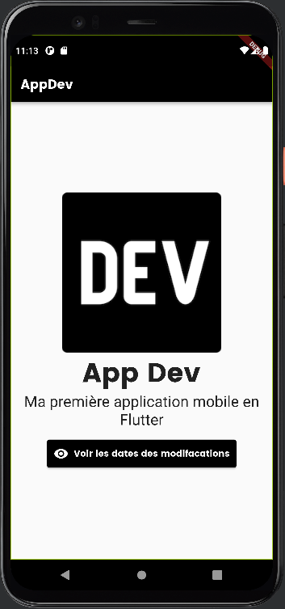

# AppDev-Flutter

Contexte : Dans l'apprentissage, du langage de programmation Dart(Flutter). J'ai coder ma première application mobile front.

Version 1 15/01/2023 :

Version 2 21/01/2023 :

J'ai ajouté à la page principale de mon application mobile, un bouton qui redirige vers une autre page :

Cette seconde page, contiendra une liste des dates de mes modifications :

Version 3 23/01/2023 :

La seconde page a été modifiée, la liste de mes modifications a bien été ajoutée :

